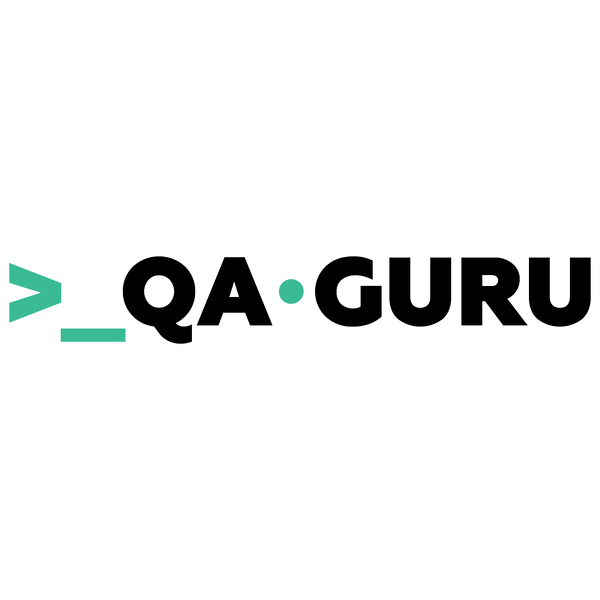

## Hi there 👋
* My name is Vika!:cherry_blossom:

* I'm junior QA Engineer, searching for a job now

* Сurrently in St. Petersburg 

* [My linkedin](https://www.linkedin.com/in/%D0%B2%D0%B8%D0%BA%D1%82%D0%BE%D1%80%D0%B8%D1%8F-%D0%B4%D1%8B%D0%BC%D0%BA%D0%BE%D0%B2%D0%B0-bbb36422b/#education)  

 * [My sertificate](https://drive.google.com/file/d/1DguQk9spa3i-oVdAeNJY6rca2CsQp1o2/view?usp=sharing)

* English - B1 

### Technology stack

### My education experience

||[qa.guru](https://qa.guru)| Automation QA Engineer (2022)|
|:-|:-|:-|
||[Mining University](https://www.spmi.ru/)| Logistics and management in transport(2015)|

